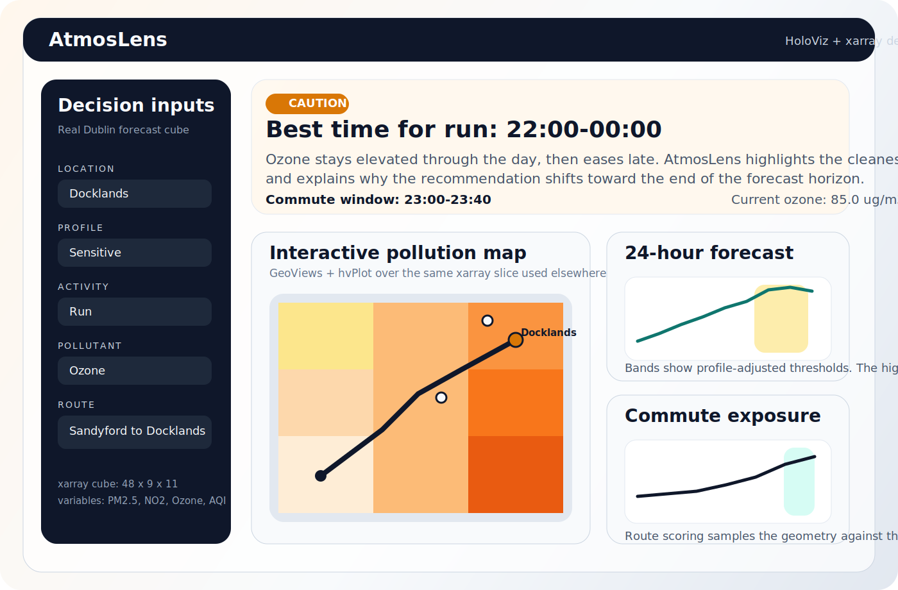
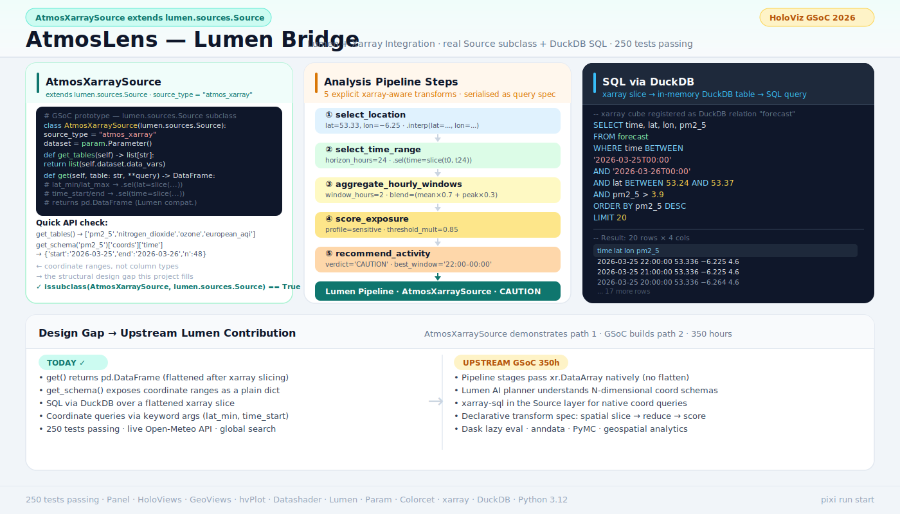

# AtmosLens

AtmosLens is an air-quality decision copilot built with the HoloViz ecosystem surfaced through [`holoviz/holoviz`](https://github.com/holoviz/holoviz). It turns a real xarray-backed forecast cube into recommendations such as when to run, when to ventilate, and which commute departure window minimizes exposure, and now supports typed global place search, editable coordinates, and route endpoints.



## Why this exists

Air-quality forecasts are easy to find and hard to act on. Most people still have to translate a map, a number, and a time series into a decision on their own.

AtmosLens closes that gap:

- pick a location
- pick a health profile
- pick an activity
- pick a pollutant and time horizon
- get a clear verdict, a best window, a map, a timeline, and a route-exposure comparison

This repo is intentionally scoped as a strong March 31 artifact: something a HoloViz mentor can open, run, understand quickly, and recognize as a natural bridge toward native Lumen + xarray support.

## What the app shows

- **Activity Safety Advisor**: `Good`, `Caution`, or `Avoid`, plus the best time window and a short explanation.
- **Interactive Pollution Map**: xarray-backed gridded data rendered with GeoViews + hvPlot.
- **24-hour Forecast Timeline**: threshold bands and the highlighted best window.
- **Decision Matrix**: compares profiles and activities side by side at the same location to show that the recommendation engine generalizes beyond a single query.
- **Recommendation Card**: concise user-facing guidance instead of a raw forecast dump.
- **Route / Commute Exposure Window**: preset or search-driven route endpoints sampled against the same gridded forecast across multiple departure times.
- **Global Search + Region Refresh**: type a city, district, or postcode anywhere on Earth, refresh the forecast cube, and reuse the same xarray pipeline.

The preview above uses the real Dublin sample cube with `Ozone` selected because it produces a more legible risk gradient than PM2.5 on the fetched March 25 forecast.

## HoloViz stack used explicitly

- `Panel` for the application shell, widgets, cards, and layout
- `GeoViews` for map-native overlays and route rendering
- `HoloViews` for structured overlays such as threshold bands and best-window spans
- `hvPlot` for quick plotting directly from xarray / pandas objects
- `Datashader` for rasterizing the map layer through the HoloViews/GeoViews stack
- `Lumen` for a real in-app pipeline preview over the recommendation tables
- `Param` for reactive state instead of ad hoc widget wiring
- `Colorcet` for scientifically sane colormaps
- `xarray` as the canonical data model for labeled N-dimensional air-quality data

## Why xarray matters here

- The source data is a real forecast cube with `time x lat x lon` dimensions.
- Location lookups, map slices, and route sampling all come from the same labeled dataset.
- The app logic stays dimension-aware instead of flattening everything into unrelated tables.
- That makes AtmosLens a credible motivating artifact for upstream Lumen work on first-class xarray sources and transforms.

## Why this naturally becomes a Lumen + xarray project

AtmosLens already contains a small bridge in [`src/atmoslens/lumen_bridge.py`](src/atmoslens/lumen_bridge.py). It does three things that point directly at the upstream problem:

- introspects xarray dims, coords, and variables
- represents the analysis as explicit transform steps
- serializes the request as a query-spec-like structure

That is the start of an `XarraySource` story, not a fake extra module. The app hits a real architectural boundary: the workflow is naturally pipeline-based, but the source is still an xarray dataset.

The HoloViz umbrella repo describes its core projects as `Panel`, `hvPlot`, `HoloViews`, `GeoViews`, `Datashader`, `Lumen`, `Colorcet`, and `Param`; AtmosLens now uses all of those except that Lumen is intentionally applied as a bridge around tabular pipeline outputs rather than as the primary app shell, because the missing upstream piece is first-class xarray support. The umbrella repo also describes itself as an entry point for workflows that combine multiple HoloViz tools in a single application, which is exactly the role AtmosLens is playing here. Sources: [holoviz/holoviz](https://github.com/holoviz/holoviz), [README lines 277-309](https://github.com/holoviz/holoviz#readme).



## Quickstart

### Option 1: Pixi

```bash
pixi install
pixi run run
```

### Option 2: pip + venv

```bash
python3.12 -m venv .venv
.venv/bin/pip install -e '.[dev]'
.venv/bin/panel serve app.py --autoreload --show
```

### Refresh the sample dataset

The repo includes `data/sample_forecast.nc`. To regenerate it from the Open-Meteo air-quality API:

```bash
.venv/bin/atmoslens-fetch --output data/sample_forecast.nc
```

Inside the app, you can type a decision point into the search bar to geocode it anywhere in the world and fetch a live xarray forecast cube for that area. Route searches also auto-fit a local corridor, and `Load Route Corridor Forecast` refreshes the commute cube after you resolve both endpoints.

## Data provenance

- Source: Open-Meteo Air Quality API
- Domain: `cams_europe`
- Region: Dublin commuter belt
- Grid: `48 x 9 x 11` (`time x lat x lon`)
- Variables: `pm2_5`, `nitrogen_dioxide`, `ozone`, `european_aqi`

The fetch path intentionally builds a small regular grid around a real metro region, writes it to NetCDF, and then treats that file as the canonical xarray source for the app.

## Repo layout

- [`app.py`](app.py): Panel entrypoint
- [`pyproject.toml`](pyproject.toml): pip-friendly project definition
- [`pixi.toml`](pixi.toml): conda-forge / Pixi environment
- [`src/atmoslens/datasets.py`](src/atmoslens/datasets.py): real-data fetch and dataset normalization
- [`src/atmoslens/profiles.py`](src/atmoslens/profiles.py): health profiles, activities, thresholds
- [`src/atmoslens/scoring.py`](src/atmoslens/scoring.py): best-window scoring and verdict logic
- [`src/atmoslens/exposure.py`](src/atmoslens/exposure.py): route sampling and departure-time exposure ranking
- [`src/atmoslens/recommendations.py`](src/atmoslens/recommendations.py): user-facing recommendation assembly
- [`src/atmoslens/plotting.py`](src/atmoslens/plotting.py): GeoViews / HoloViews / hvPlot visual layer
- [`src/atmoslens/lumen_support.py`](src/atmoslens/lumen_support.py): Lumen `Pipeline` helpers over AtmosLens outputs
- [`src/atmoslens/state.py`](src/atmoslens/state.py): Param-based reactive state
- [`src/atmoslens/views.py`](src/atmoslens/views.py): app layout and cards
- [`src/atmoslens/lumen_bridge.py`](src/atmoslens/lumen_bridge.py): xarray-to-pipeline bridge prototype
- [`notebooks/`](notebooks): exploration, logic validation, bridge prototyping
- [`tests/`](tests): focused tests around thresholds, recommendations, exposure, and bridge serialization

## Tests

```bash
.venv/bin/pytest
```

Current local status:

- `10 passed` on Python `3.12.12`
- app object verified by importing `build_app()` and constructing the `FastListTemplate`

## Demo framing for HoloViz / GSoC

AtmosLens is not trying to be a complete air-quality platform. It is a convincing HoloViz artifact that shows:

- real xarray-backed scientific data
- visible use of the HoloViz ecosystem surfaced through `holoviz/holoviz`
- a non-trivial decision layer on top of the data
- scenario-level reasoning across multiple health profiles and activities at the same place
- a clear path toward upstream Lumen work on xarray-native sources and transforms
